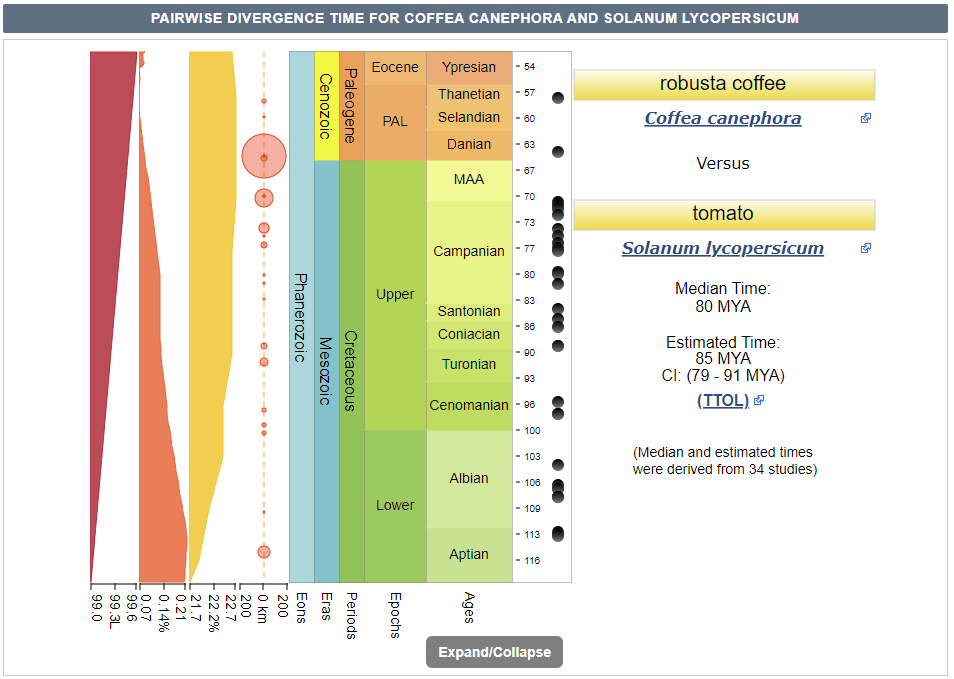
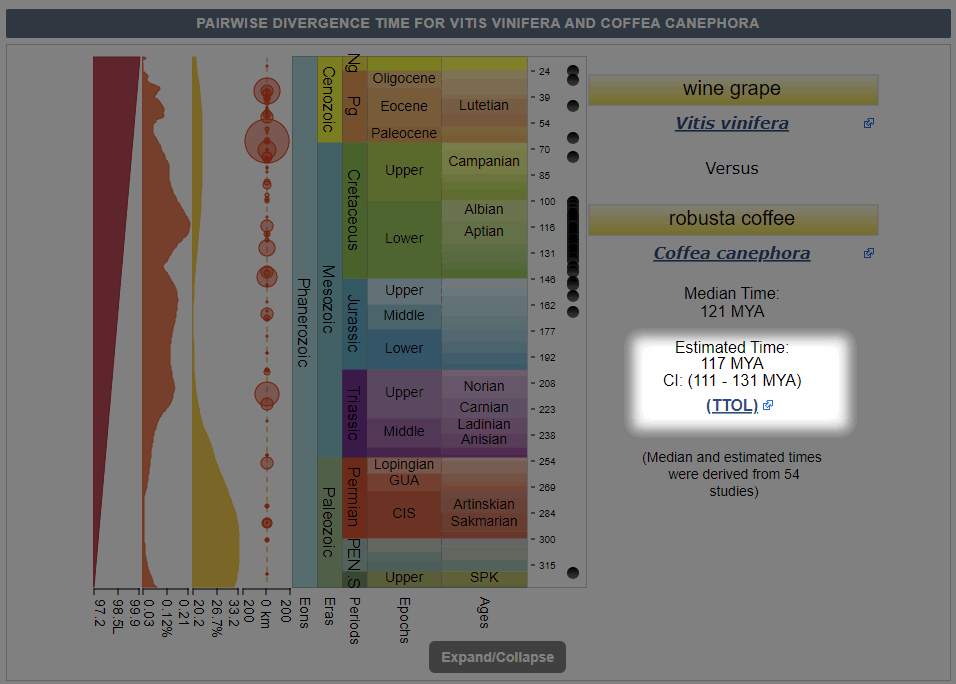

# Divergence_time_tree
Estimation of species divergence time

## Dependency package
1. [Orthfiner2](https://github.com/davidemms/OrthoFinder)
2. [PAML](http://abacus.gene.ucl.ac.uk/software/paml.html) paml4.9j.tgz
3. [Muscle](http://drive5.com/muscle/)
4. [Biopython](https://biopython.org/)

## Prepared file
1.coding sequence and protein sequence of each species in fasta format
like example 


## How to use
### 1. Run orthfinder2 ([Orthfiner2 readme](https://github.com/davidemms/OrthoFinder))
```bash
./orthofinder -f Data/
```
### 2.Copy useful file
```bash
cp Orthogroups/Orthogroups_SingleCopyOrthologues.txt Orthogroups/Orthogroups.txt Species_Tree/SpeciesTree_rooted.txt workDirectory
```
### 3.Rewrite tree file
Referring to the phylogenetic tree of orthofinder and the fossil time range of [Timetree](http://www.timetree.org/), rewrite the tree file
#### 3.1 check the tree of orthofinder
```bash
cat  SpeciesTree_rooted.txt
#(Vitis_vinifera:0.124147,(Coffea_canephora:0.196146,(Solanum_lycopersicum:0.195935,((Cuscuta_campestris:0.0146811,Cuscuta_australis:0.0347711)0.949219:0.185453,((Ipomoea_nil:0.0217926,Ipomoea_aquatica:0.0289792)0.253723:0.0123219,(Ipomoea_batatas:0.387199,(Ipomoea_triloba:0.00613322,Ipomoea_trifida:0.0061229)0.421138:0.0184493)0.440876:0.0245531)0.718464:0.0782321)0.78037:0.0732721)0.65297:0.0417202)1:0.124147);
```
#### 3.2 reconstituted species tree
Remember to change the species name to less than 10 characters
```bash
vi treefile
# 10  1

#(Vvinifera, (Ccanephora , (Slycopers, ((Ccampestri, Caustralis)((Inil, Iaquatica), (Ibatatas, (Itriloba, Itrifida)))))));
```
#### 3.3 time search in [Timetree](http://www.timetree.org/) and reconstituted species tree




```bash
vi treefile
#6 1
# 10  1

#(Vvinifera, (Ccanephora , (Slycopers, ((Ccampestri, Caustralis)((Inil, Iaquatica), (Ibatatas, (Itriloba, Itrifida))))))'>0.79<0.91')'>1.11<1.31';
```
### 4.Filter Single Copy Sequence
```python
python filterSingleCopySequence.py
```
### 5.Rename Single Copy Sequence
Modify the single copy gene name to be consistent with the name in the species
```python
python batchFileRename.py
```
### 6.Batch multiple sequence alignment
```python
python batchFile2Phy.py
```
### 7.Convert phylip alignmnet
Convert the FASTA format of multi sequence alignment into the phylip sequential format recognized by PAML
```python
python phylipConvert.py
```
### 8.Delete stop codon
Delete the stop codon in the sequence
```python
python deleteStopCodon.py
```
### 9.Run paml mcmctree
#### 9.1 Configure 'mcmctree.ctl' file
```bash
vi mcmctree.ctl
#          seed = -1
       seqfile = mtCDNApri123.txt ### Change to the actual file name
      treefile = mtCDNApri.trees ### Change to the actual file name
      mcmcfile = mcmc.txt
       outfile = out.txt

         ndata = 3
       seqtype = 0    * 0: nucleotides; 1:codons; 2:AAs
       usedata = 1    * 0: no data; 1:seq like; 2:normal approximation; 3:out.BV (in.BV)
         clock = 2    * 1: global clock; 2: independent rates; 3: correlated rates
       RootAge = '<1.0'  * safe constraint on root age, used if no fossil for root.

         model = 0    * 0:JC69, 1:K80, 2:F81, 3:F84, 4:HKY85
         alpha = 0    * alpha for gamma rates at sites
         ncatG = 5    * No. categories in discrete gamma

     cleandata = 0    * remove sites with ambiguity data (1:yes, 0:no)?

       BDparas = 1 1 0.1  * birth, death, sampling
   kappa_gamma = 6 2      * gamma prior for kappa
   alpha_gamma = 1 1      * gamma prior for alpha

   rgene_gamma = 2 20 1   * gammaDir prior for rate for genes
  sigma2_gamma = 1 10 1   * gammaDir prior for sigma^2     (for clock=2 or 3)

      finetune = 1: .1 .1 .1 .1 .1 .1 * auto (0 or 1): times, musigma2, rates, mixing, paras, FossilErr

         print = 1   * 0: no mcmc sample; 1: everything except branch rates 2: everything
        burnin = 2000
      sampfreq = 10
       nsample = 20000

*** Note: Make your window wider (100 columns) before running the program.

```
#### 9.2 run mcmctree
```bash
./mcmctree mcmctree.ctl
```
## Result
1.FigTree1.tre
```
#NEXUS
BEGIN TREES;

	UTREE 1 = (Vvinifera: 1.181926, (Ccanephora: 0.870088, (Slycopers: 0.718614, ((Ccampestri: 0.034704, Caustralis: 0.034704) [&95%HPD={0.014307, 0.0578108}]: 0.364862, ((Inil: 0.082970, Iaquatica: 0.082970) [&95%HPD={0.0473958, 0.125509}]: 0.004822, (Ibatatas: 0.041204, (Itriloba: 0.038652, Itrifida: 0.038652) [&95%HPD={0.0207573, 0.0604043}]: 0.002551) [&95%HPD={0.0227154, 0.0636135}]: 0.046589) [&95%HPD={0.0525574, 0.130633}]: 0.311773) [&95%HPD={0.27958, 0.519542}]: 0.319049) [&95%HPD={0.609845, 0.823407}]: 0.151473) [&95%HPD={0.802348, 0.915719}]: 0.311839) [&95%HPD={1.10291, 1.29469}];

END;

``` 
