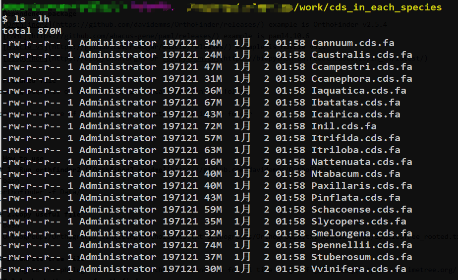
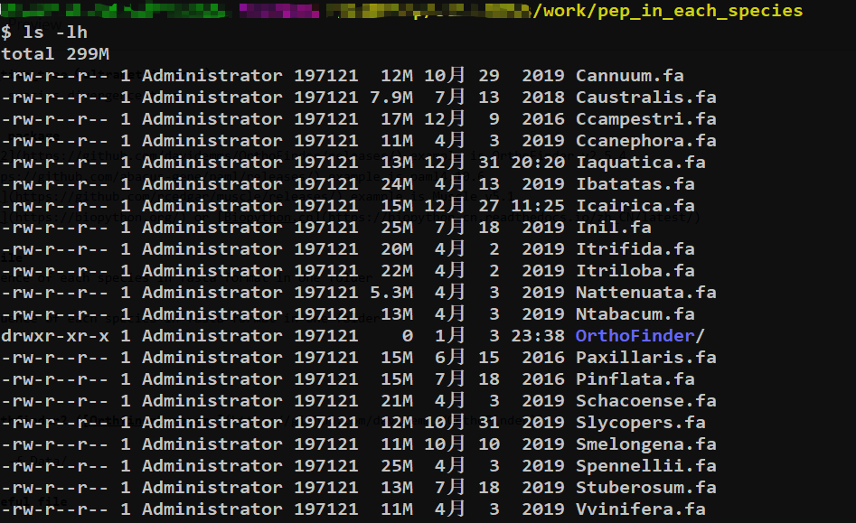
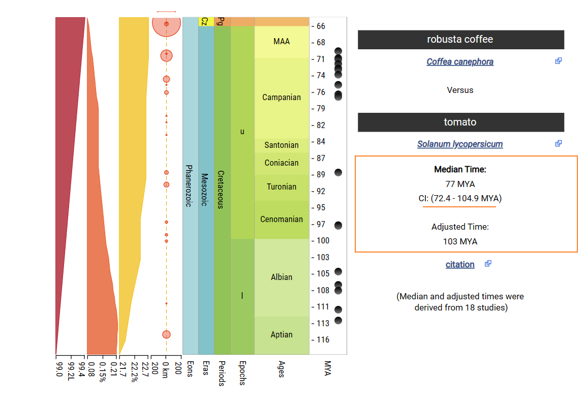
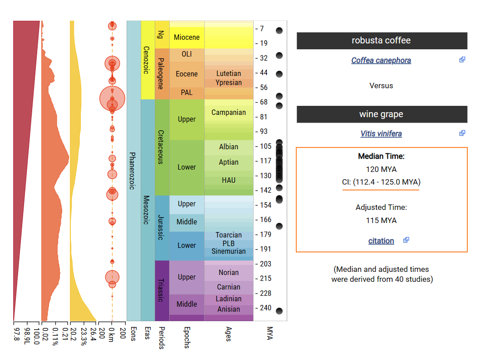

# Divergence_time_tree（ultrametric tree）
Estimation of species divergence time

## * Dependency package
1. [Orthfiner2](https://github.com/davidemms/OrthoFinder/releases/) example is OrthoFinder v2.5.4
2. [PAML](https://github.com/abacus-gene/paml/releases/) example is paml4.10.6
3. [Muscle v5](https://github.com/rcedgar/muscle/releases/) example is Muscle v5.1
4. [Biopython](https://biopython.org/) or [Biopython.cn](https://biopython-cn.readthedocs.io/zh_CN/latest/)

## * Prepared file
1.coding sequence of each species in fasta format in one folder

2.protein sequence of each species in fasta format in one folder

3.Merge all cds files into the your_working directory
```bash
cat cds_in_each_species/*.fa > your_working_directory/sol.cds.all.fa
```
## * How to use
### 1. Run orthfinder2 
Use the protein foler of the species as input to execute the orthfinder software.
The prefix of each cds file is species identification, and the recommended suffix is fa, which is convenient for subsequent processes to read.

```bash
./orthofinder -f pep_in_each_species/
```
Add or remove species can be combined with-b and-f parameters, refer to the instructions for the use of orthfinder([Orthfiner2 readme](https://github.com/davidemms/OrthoFinder))

### 2.Copy useful file
Copy useful orthfiner results(Orthogroups_SingleCopyOrthologues.txt, Orthogroups.txt and SpeciesTree_rooted.txt) to the working directory

```bash
cp Orthogroups/Orthogroups_SingleCopyOrthologues.txt Orthogroups/Orthogroups.txt Species_Tree/SpeciesTree_rooted.txt workDirectory
```
### 3.Rewrite tree file
Referring to the phylogenetic tree of orthofinder and the fossil time range of [Timetree](http://www.timetree.org/), rewrite the tree file

#### 3.1 check and preprocess the tree of orthfinder
View and preprocess the tree of orthofinder

**3.1.1 check tree file**
```bash
cat  SpeciesTree_rooted.txt
```
```bash
(Vitis_vinifera:0.124147,(Coffea_canephora:0.196146,(Solanum_lycopersicum:0.195935,((Cuscuta_campestris:0.0146811,Cuscuta_australis:0.0347711)0.949219:0.185453,((Ipomoea_nil:0.0217926,Ipomoea_aquatica:0.0289792)0.253723:0.0123219,(Ipomoea_batatas:0.387199,(Ipomoea_triloba:0.00613322,Ipomoea_trifida:0.0061229)0.421138:0.0184493)0.440876:0.0245531)0.718464:0.0782321)0.78037:0.0732721)0.65297:0.0417202)1:0.124147);
```

**3.1.2 pre-processing tree file**
```bash
python phyTree.py -c SpeciesTree_rooted.txt SpeciesTree_rooted.rewrite.txt
```
```bash
cat  SpeciesTree_rooted.rewrite.txt
```
```bash
(Vvinifera,(Ccanephora,((((Inil,((Itrifida,Itriloba),Ibatatas)),(Icairica,Iaquatica)),(Ccampestri,Caustralis)),(((Smelongena,((Schacoense,Stuberosum),(Spennellii,Slycopers))),Cannuum),((Nattenuata,Ntabacum),(Paxillaris,Pinflata))))));
```
#### 3.2 reconstituted species tree
Remember to change the species name to less than 10 characters
```bash
vi SpeciesTree_rooted.rewrite.txt
```
```bash
 20  1

(Vvinifera,(Ccanephora,((((Inil,((Itrifida,Itriloba),Ibatatas)),(Icairica,Iaquatica)),(Ccampestri,Caustralis)),(((Smelongena,((Schacoense,Stuberosum),(Spennellii,Slycopers))),Cannuum),((Nattenuata,Ntabacum),(Paxillaris,Pinflata))))));
```
20 and 1 represent the number of species and trees, respectively

#### 3.3 time search in [Timetree](http://www.timetree.org/) and reconstituted species tree

**3.3.1 Query the existing fossil time**

The divergence time between Coffea canephora and Solanum lycopersicum is about 72.4-104.9mya.


The divergence time between Coffea canephora and Solanum lycopersicum is about 112.4-125.0mya.


**3.3.2 Add calibration time to tree file**
```bash
vi SpeciesTree_rooted.rewrite.txt
```
```bash
 20  1

(Vvinifera,(Ccanephora,((((Inil,((Itrifida,Itriloba),Ibatatas)),(Icairica,Iaquatica)),(Ccampestri,Caustralis)),(((Smelongena,((Schacoense,Stuberosum),(Spennellii,Slycopers))),Cannuum),((Nattenuata,Ntabacum),(Paxillaris,Pinflata)))))'>0.724<1.049')'>1.124<1.25';

//end of file
```
### 4.Perform extraction and alignment of single-copy gene sequences
**4.1 View script help**
```python
python singleCopyAlign2paml_workflow.py -h
```
```bash
usage: extractSingleCopySequence.py [-h] oscgroups ogroups allcds

用途：提取Orthogroups.txt中的单拷贝基因序列，并对每组单拷贝基因进行序列比对。

positional arguments:
  oscgroups   Orthfinder resulte file: "Orthogroups_SingleCopyOrthologues.txt" (type = str)
  ogroups     Orthfinder resulte file: "Orthogroups.txt" (type = str)
  allcds      a merged coding squence file of all used species (type = str)

optional arguments:
  -h, --help  show this help message and exit
```

**4.2 Execute script**
```python
python singleCopyAlign2paml_workflow.py Orthogroups_SingleCopyOrthologues.txt Orthogroups.txt sol.cds.all.fa
```
This script is equivalent to using the following script in turn:

> extractSingleCopySequence.py --> batchId2Spname.py --> batchSeqAlign.py --> fasAlign2phy.py -->delStopCodon.py

Use the -h parameter to understand how to use it.

### 5.Run paml mcmctree
#### 5.1 Configure 'mcmctree.ctl' file
```bash
cp mcmctree.ctl sol.mcmctree.ctl
vi sol.mcmctree.ctl
```
```bash
          seed = -1
       seqfile = mtCDNApri123.txt ### Change to the alignment file name: all.delStopCodon.phys
      treefile = mtCDNApri.trees ### Change to the tree file name: SpeciesTree_rooted.rewrite.txt
      mcmcfile = mcmc.txt
       outfile = out.txt

         ndata = 2    ### chang to alignment number,this example is 2
       seqtype = 0    * 0: nucleotides; 1:codons; 2:AAs
       usedata = 1    * 0: no data; 1:seq like; 2:normal approximation; 3:out.BV (in.BV)
         clock = 2    * 1: global clock; 2: independent rates; 3: correlated rates
       RootAge = '<1.0'  * safe constraint on root age, used if no fossil for root.

         model = 0    * 0:JC69, 1:K80, 2:F81, 3:F84, 4:HKY85
         alpha = 0    * alpha for gamma rates at sites
         ncatG = 5    * No. categories in discrete gamma

     cleandata = 0    * remove sites with ambiguity data (1:yes, 0:no)?

       BDparas = 1 1 0.1  * birth, death, sampling
   kappa_gamma = 6 2      * gamma prior for kappa
   alpha_gamma = 1 1      * gamma prior for alpha

   rgene_gamma = 2 20 1   * gammaDir prior for rate for genes
  sigma2_gamma = 1 10 1   * gammaDir prior for sigma^2     (for clock=2 or 3)

      finetune = 1: .1 .1 .1 .1 .1 .1 * auto (0 or 1): times, musigma2, rates, mixing, paras, FossilErr

         print = 1   * 0: no mcmc sample; 1: everything except branch rates 2: everything
        burnin = 2000
      sampfreq = 10
       nsample = 20000

*** Note: Make your window wider (100 columns) before running the program.

```
#### 5.2 run mcmctree in paml
```bash
mcmctree sol.mcmctree.ctl
```
## Result
### 1.FigTree.tre
ultrametric tree of selected species in NEXUS format（The time standard is 100 million years）

```bash
vi FigTree.tre
```
```bash
#NEXUS
BEGIN TREES;

	UTREE 1 = (Vvinifera: 1.182571, (Ccanephora: 0.957549, ((((Inil: 0.144686, ((Itrifida: 0.051791, Itriloba: 0.051791) [&95%HPD={0.0180103, 0.0907333}]: 0.027058, Ibatatas: 0.078849) [&95%HPD={0.0342785, 0.127052}]: 0.065837) [&95%HPD={0.0765007, 0.224146}]: 0.057742, (Icairica: 0.182582, Iaquatica: 0.182582) [&95%HPD={0.092973, 0.282555}]: 0.019846) [&95%HPD={0.112743, 0.30083}]: 0.334590, (Ccampestri: 0.121145, Caustralis: 0.121145) [&95%HPD={0.037339, 0.218144}]: 0.415872) [&95%HPD={0.368526, 0.701565}]: 0.279506, (((Smelongena: 0.204091, ((Schacoense: 0.034018, Stuberosum: 0.034018) [&95%HPD={0.0081394, 0.0673773}]: 0.048750, (Spennellii: 0.019273, Slycopers: 0.019273) [&95%HPD={0.0033041, 0.0397274}]: 0.063495) [&95%HPD={0.038023, 0.136205}]: 0.121324) [&95%HPD={0.113544, 0.305304}]: 0.094774, Cannuum: 0.298865) [&95%HPD={0.178539, 0.422947}]: 0.150367, ((Nattenuata: 0.115726, Ntabacum: 0.115726) [&95%HPD={0.0393255, 0.212033}]: 0.276721, (Paxillaris: 0.109594, Pinflata: 0.109594) [&95%HPD={0.0401356, 0.193081}]: 0.282852) [&95%HPD={0.244036, 0.546504}]: 0.056785) [&95%HPD={0.302158, 0.609576}]: 0.367292) [&95%HPD={0.652822, 0.961443}]: 0.141026) [&95%HPD={0.794656, 1.06636}]: 0.225022) [&95%HPD={1.12196, 1.24766}];

END;
``` 
### 2.Open and convert with [Figtree](http://tree.bio.ed.ac.uk/software/figtree/) and convert to nwk format 

#### 2.1 figure of ultrametric tree 


#### 2.2 ultrametric tree in nwk format
export as a Newick: File > Save Trees > Select 'Newick' from menu.

If you save it and name it FigTree.tre.nwk.
```bash
cat FigTree.tre.nwk
```
```
(Vvinifera:1.182571,(Ccanephora:0.957549,((((Inil:0.144686,((Itrifida:0.051791,Itriloba:0.051791):0.027058,Ibatatas:0.078849):0.065837):0.057742,(Icairica:0.182582,Iaquatica:0.182582):0.019846):0.33459,(Ccampestri:0.121145,Caustralis:0.121145):0.415872):0.279506,(((Smelongena:0.204091,((Schacoense:0.034018,Stuberosum:0.034018):0.04875,(Spennellii:0.019273,Slycopers:0.019273):0.063495):0.121324):0.094774,Cannuum:0.298865):0.150367,((Nattenuata:0.115726,Ntabacum:0.115726):0.276721,(Paxillaris:0.109594,Pinflata:0.109594):0.282852):0.056785):0.367292):0.141026):0.225022);
```
## * Follow-up analysis
With a little modification, the above results can be used in the input file of [CAFE](https://github.com/hahnlab/CAFE) and [CAFE5](https://github.com/hahnlab/CAFE5).

> For a typical CAFE analysis, users are most interested in determining two things:
> 
>             * Which gene families are rapidly evolving
> 
>             * The branches of the tree on which these families are rapidly evolving

**1. Modify the Orthogroups.GeneCount.tsv file of OrthoFinder to generate a gene family count file that meets the requirements of CAFE5.**

```bash
awk 'OFS="\t" {$NF=""; print}' Orthogroups.GeneCount.tsv > tmp && awk '{print "(null)""\t"$0}' tmp > cafe.input.tsv && sed -i '1s/(null)/Desc/g' cafe.input.tsv && rm tmp
```
**2.Filtering exception family**

After that, it is necessary to eliminate the gene families with excessive copy number differences between different species, otherwise an error will be reported. 
CAFE5 has built-in scripts to use, and sometimes you need to remove the first line before you run it.

```python
python ~/soft/CAFE5/tutorial/clade_and_size_filter.py -i cafe.input.tsv -o gene_family_filter.txt -s 
```
The output should be two CAFE input files, one for gene families with < 100 gene copies in all species(gene_family_filter.txt), another for the remaining gene families(large_gene_family_filter.txt). 
The first file should be used to estimate parameter values, and these values should then be used to analyse the second file.
Refer to the cafetutorial_clade_and_size_filter.py of [cafe_tutorial](https://github.com/hahnlab/cafe_tutorial/blob/main/python_scripts/cafetutorial_clade_and_size_filter.py)

**3. Ultrametric tree in Newick format**

The time of the previous Ultrametric tree needs to be multiplied by 100, so the time base becomes MYA, which can be directly used as the second input file.

```bash
sed 's/\([),]\)/\n\1/g' FigTree.tre.nwk | awk -F ":" '{if($2~/[0-9]/){printf $1":"$2*100}else{print $0}}'
```
```bash
(Vvinifera:118.257,(Ccanephora:95.7549,((((Inil:14.4686,((Itrifida:5.1791,Itriloba:5.1791):2.7058,Ibatatas:7.8849):6.5837):5.7742,(Icairica:18.2582,Iaquatica:18.2582):1.9846):33.459,(Ccampestri:12.1145,Caustralis:12.1145):41.5872):27.9506,(((Smelongena:20.4091,((Schacoense:3.4018,Stuberosum:3.4018):4.875,(Spennellii:1.9273,Slycopers:1.9273):6.3495):12.1324):9.4774,Cannuum:29.8865):15.0367,((Nattenuata:11.5726,Ntabacum:11.5726):27.6721,(Paxillaris:10.9594,Pinflata:10.9594):28.2852):5.6785):36.7292):14.1026):22.5022);
```

**4. Run CAFE**

**4.1 Copy and rename the shell script for cafe**

```bash
cp ~soft/CAFE/example/cafe_script2.sh your_working_directory/cafe_script_sol.sh
```
**4.2 Modify the shell script**

**Before modify**

```bash
vi cafe_script_sol.sh
```
```bash
#!shell
date
version

#specify data file, p-value threshold, # of threads to use, and log file
load -i example_data.tab -p 0.01 -t 10 -l log.txt

#the phylogenetic tree structure with branch lengths
tree (((chimp:6,human:6):81,(mouse:17,rat:17):70):6,dog:93)

#search for 2 parameter model
lambda -s -t (((2,2)1,(1,1)1)1,1)

# generate a report
report report.txt
```

**After modify**

```bash
vi cafe_script_sol.sh
```

```bash
#!shell
date

#specify data file, p-value threshold, # of threads to use, and log file
load -i gene_family_filter.txt -p 0.01 -t 10 -l log.txt

#the phylogenetic tree structure with branch lengths
tree (Vvinifera:118.257,(Ccanephora:95.7549,((((Inil:14.4686,((Itrifida:5.1791,Itriloba:5.1791):2.7058,Ibatatas:7.8849):6.5837):5.7742,(Icairica:18.2582,Iaquatica:18.2582):1.9846):33.459,(Ccampestri:12.1145,Caustralis:12.1145):41.5872):27.9506,(((Smelongena:20.4091,((Schacoense:3.4018,Stuberosum:3.4018):4.875,(Spennellii:1.9273,Slycopers:1.9273):6.3495):12.1324):9.4774,Cannuum:29.8865):15.0367,((Nattenuata:11.5726,Ntabacum:11.5726):27.6721,(Paxillaris:10.9594,Pinflata:10.9594):28.2852):5.6785):36.7292):14.1026):22.5022)

#
lambda -s

#search for 2 parameter model
#lambda -s -t (((2,2)1,(1,1)1)1,1)

#specify the global lambda to for generating simulated data
#lambda -l 0.0017

#generate 10 simulated data sets
#genfamily rndtree/rnd -t 10

#estimate lambdas and compare likelihoods of global lambda and 2-parameter models
#lhtest -d rndtree -l 0.0017 -t (((2,2)1,(1,1)1)1,1) -o lh2.out

# report output
report sol_cafe_out

date
```

**4.3 Execute cafe**

```bash
/home/xian/soft/CAFE/release/cafe cafe_script_sol.sh
```

**4.4 Integrate cafe results**

In the **python_scripts** directory of [**cafe_tutorial**](https://github.com/hahnlab/cafe_tutorial), there is a script called [**cafetutorial_report_analysis.py**](https://github.com/hahnlab/cafe_tutorial/blob/main/python_scripts/cafetutorial_report_analysis.py) (written by python2) that can collates the results of cafe.
```bash
conda activate python27

python cafetutorial_report_analysis.py -i sol_cafe_out.cafe -o sol_cafe_out.summary
```
As a result, four files appear, all prefixed with the value of the-o parameter.
* sol_cafe_out.summary_anc.txt   
每个家族在每个节点变化(扩张/收缩)的数量. The number of changes(expansion or contraction)  in each family at each node.

* sol_cafe_out.summary_fams.txt 
每个节点变化(扩张/收缩)的家族编号(\*表示显著). Family IDs that changes(expansion or contraction) at each node(\ * indicates significant).

* sol_cafe_out.summary_node.txt 
每个节点中变化(扩张/收缩)的基因家族数量. The number of gene families that change(expansion or contraction) in each node

* sol_cafe_out.summary_pub.txt 
每个物种中基因家族的变化数量. The number of changes in gene families in each species.

For the parameter settings and the meaning of the results, please read the [CAFE](https://github.com/hahnlab/CAFE) documentation in detail.

**4.5 CAFE_fig**

The results of CAFE can be displayed through [**CAFE_fig**](https://github.com/LKremer/CAFE_fig).
CAFE_fig requires Python3.4+ and ETE3: Install ETE3 with
```bash
pip3 install 'ete3==3.0.0b35'
or
pip3 install 'ete3==3.1.2'
```
```bash
python CAFE_fig.py sol_cafe_out.cafe -pb 0.01 -pf 0.01 --dump test -g pdf 
```


**5. Run Cafe5**

```bash
cafe5 -i gene_family_filter.txt -t FigTree.tre.nwk -o out
```
Cafe5 uses the Base model by default, and you can use the Gamma model with the-k parameter.

For the parameter settings and the meaning of the results, please read the [CAFE5](https://github.com/hahnlab/CAFE5) documentation in detail.

**Note1:** Well, this small process is equivalent to [2.Preparing the input](https://github.com/hahnlab/CAFE5/blob/master/docs/tutorial/tutorial.md) in cafe5, but it's a little easier to operate.

**Note2:** There are four parts of the files or folders in the process are not provided in this github directory, namely:
./cds_in_each_species, ./pep_in_each_species, sol.cds.all.fa and OrthoFinder result directory. 
The reason is that I can't upload large files successfully.

**Note3:** This is a problem showing the results of CAFE5, because [CAFE_fig](https://github.com/LKremer/CAFE_fig) is no longer available for CAFE5 and can only be used for older versions of CAFE. 
If I have time later, I will modify the script to make it easy to use.. 
