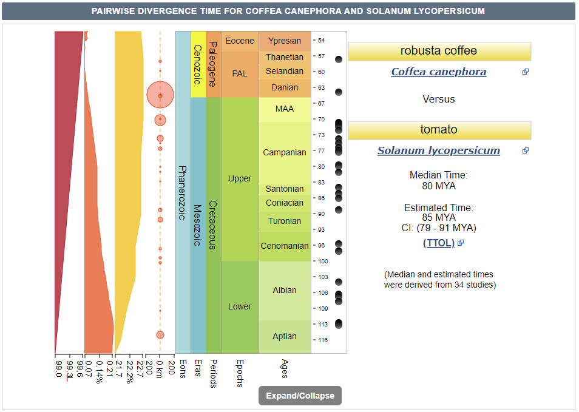

# Divergence_time_tree
Estimation of species divergence time

## Dependency package
1. [Orthfiner2](https://github.com/davidemms/OrthoFinder)
2. [PAML](http://abacus.gene.ucl.ac.uk/software/paml.html) paml4.9j.tgz
3. [Muscle](http://drive5.com/muscle/)
4. [Biopython](https://biopython.org/)

## Prepared file
1.coding sequence and protein sequence of each species in fasta format
like example 


## How to use
### 1. Run orthfinder2 ([Orthfiner2 readme](https://github.com/davidemms/OrthoFinder))
```bash
./orthofinder -f Data/
```
### 2.Copy useful file
```bash
cp Orthogroups/Orthogroups_SingleCopyOrthologues.txt Orthogroups/Orthogroups.txt Species_Tree/SpeciesTree_rooted.txt workDirectory
```
### 3.Rewrite tree file
Referring to the phylogenetic tree of orthofinder and the fossil time range of [Timetree](http://www.timetree.org/), rewrite the tree file
#### 3.1 check the tree of orthofinder
```bash
cat  SpeciesTree_rooted.txt
#(Vitis_vinifera:0.124147,(Coffea_canephora:0.196146,(Solanum_lycopersicum:0.195935,((Cuscuta_campestris:0.0146811,Cuscuta_australis:0.0347711)0.949219:0.185453,((Ipomoea_nil:0.0217926,Ipomoea_aquatica:0.0289792)0.253723:0.0123219,(Ipomoea_batatas:0.387199,(Ipomoea_triloba:0.00613322,Ipomoea_trifida:0.0061229)0.421138:0.0184493)0.440876:0.0245531)0.718464:0.0782321)0.78037:0.0732721)0.65297:0.0417202)1:0.124147);
```
#### 3.2 reconstituted species tree
Remember to change the species name to less than 10 characters
```bash
vi treefile
# 10  1

#(Vvinifera, (Ccanephora , (Slycopers, ((Ccampestri, Caustralis)((Inil, Iaquatica), (Ibatatas, (Itriloba, Itrifida)))))));
```
#### 3.3 time search in [Timetree](http://www.timetree.org/) and reconstituted species tree


```bash
vi treefile
#6 1
# 10  1

#(Vvinifera, (Ccanephora , (Slycopers, ((Ccampestri, Caustralis)((Inil, Iaquatica), (Ibatatas, (Itriloba, Itrifida))))))'>0.79<0.91')'>1.11<1.31';
```
### 4.Filter Single Copy Sequence
```python
python filterSingleCopySequence.py
```
### 5.Rename Single Copy Sequence
Modify the single copy gene name to be consistent with the name in the species
```python
python batchFileRename.py
```
### 6.Batch multiple sequence alignment
```python
python batchFile2Phy.py
```
### 7.Convert phylip alignmnet
Convert the FASTA format of multi sequence alignment into the phylip sequential format recognized by PAML
```python
python phylipConvert.py
```
### 8.Delete stop codon
Delete the stop codon in the sequence
```python
python deleteStopCodon.py
```
### 9.Run paml mcmctree
#### 9.1 Configure 'mcmctree.ctl' file
```bash
vi mcmctree.ctl
seqfile = all.singlecopy.phy
treefile = treefile
outfile = out
```
#### 9.2 run mcmctree
```bash
./mcmctree mcmctree.ctl
```
